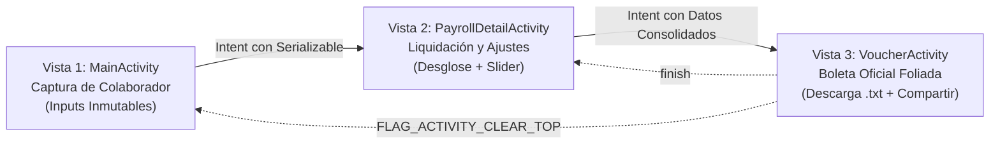

# AGENTS.md - Guía Técnica para Agentes Autónomos (Jules & Antigravity)

Este documento especifica las directrices arquitectónicas, reglas de negocio e instrucciones para agentes autónomos que colaboren en el repositorio **Act1Sem3AppsMov**.

---

## 🏛️ Arquitectura y Tecnologías
* **Plataforma:** Android Nativo
* **Lenguaje:** Kotlin
* **UI Toolkit:** Android Views (XML) con **ViewBinding**
* **Librería de Componentes:** Google Material Design 3 (`com.google.android.material:material:1.14.0`)
* **SDK:** `minSdk = 27`, `targetSdk = 37`, `compileSdk = 37`
* **Persistencia Híbrida Resiliente:**
  * **Capa Local (SSOT):** SQLite nativo (`PayrollDbHelper`) para persistencia inmediata a 0 ms (Offline-First).
  * **Capa Remota:** MySQL 5.7 / 8.x vía MariaDB Connector/J (`org.mariadb.jdbc:mariadb-java-client:3.3.3`) con JDBC directo, timeouts defensivos (4s) y operaciones en segundo plano (`Dispatchers.IO`).
  * **Coordinador:** `PayrollRepository` gestiona estados de sincronización (`PENDING`, `SYNCED`, `ERROR`).

---

## 📱 Flujo de Navegación y Vistas



### 1. Vista 1 (`MainActivity.kt` & `activity_main.xml`)
* **REGLA DE ORO:** Los 5 parámetros de entrada son requeridos por la cátedra docente y **NO DEBEN SER MODIFICADOS**:
  1. `etFirstName` (Nombres)
  2. `etLastName` (Apellidos)
  3. `etEmployeeCode` (Código de colaborador)
  4. `etHourlyRate` (Tarifa por hora)
  5. `etHoursWorked` (Horas trabajadas)
* Las validaciones defensivas deben ejecutarse en `til*` (TextInputLayout) previniendo valores vacíos o numéricos `<= 0`.

### 2. Vista 2 (`PayrollDetailActivity.kt` & `activity_payroll_detail.xml`)
* Calcula y visualiza:
  * Horas regulares (tope 40 hrs).
  * Horas extraordinarias al 150% (`overtimeHours * hourlyRate * 1.5`).
  * Bono dinámico mediante `sliderBonus` (0% a 30%).
  * Desglose de retenciones: Salud (EsSalud 4%) y Pensión (AFP/ONP 4%).
  * Total Neto a Pagar.

### 3. Vista 3 (`VoucherActivity.kt` & `activity_voucher.xml`)
* Genera folio único con timestamp.
* **Persistencia Resiliente:** Llama a `PayrollRepository.getInstance(this).savePayroll(data)` para persistir en SQLite y replicar asíncronamente a MySQL.
* **Descarga de Boleta:** Implementa el Storage Access Framework (SAF) con `ActivityResultContracts.CreateDocument("text/plain")` para guardar el archivo `.txt` en almacenamiento local con codificación UTF-8.
* **Compartir Comprobante:** Despacha un Intent implícito con `ACTION_SEND` (`Intent.createChooser`).
* **Reinicio:** Permite volver a `MainActivity` con `FLAG_ACTIVITY_CLEAR_TOP or FLAG_ACTIVITY_NEW_TASK`.

### 4. Dashboard Ejecutivo (`DashboardActivity.kt` & `activity_dashboard.xml`)
* Launcher principal de la aplicación.
* Métricas en tiempo real (Masa salarial total, recargos por horas extras, promedio neto, total de boletas).
* Control de sincronización MySQL con diagnóstico interactivo, botón de sincronización en lote y modal de configuración dinámica de servidor.

---

## 🗄️ Arquitectura de Persistencia Resiliente a Fallos (Offline-First)

```mermaid
flowchart TD
    UI["Vistas (MainActivity / Voucher / Dashboard)"] -->|Guardar / Actualizar| REPO["PayrollRepository\n(Coordinador de Dominio)"]
    REPO -->|1. Inmediato (0ms)| SQLITE[("SQLite Local (smart_payroll.db)\nsync_status: PENDING")]
    REPO -->|2. Background (Dispatchers.IO)| COROUTINE["Worker Asíncrono"]
    COROUTINE -->|3. Transacción JDBC (Timeout 4s)| MYSQL[("Servidor MySQL (smart_payroll_db)\nPuerto 3306")]
    MYSQL -.->|Éxito: Marcar SYNCED| SQLITE
    MYSQL -.->|Fallo: Preservar en SQLite (Sin Crash)| SQLITE
```

---

## 🧪 Pruebas Automatizadas (CI/CD)
Antes de someter cualquier Pull Request o commit:
1. Las fórmulas de nómina en `EmployeePayrollData.kt` y el ciclo de vida de sincronización deben tener cobertura en `EmployeePayrollDataTest.kt`.
2. Debe ejecutarse y pasar la suite completa de pruebas unitarias:
   ```bash
   ./gradlew testDebugUnitTest --no-daemon
   ```
3. El workflow `.github/workflows/jules-ci.yml` debe validar la compilación exitosa en GitHub Actions.
