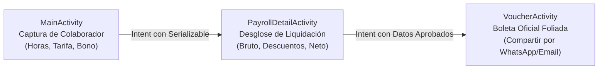

# SmartPayroll Pro — Sistema Móvil de Liquidación de Nómina y Boletas

[](https://kotlinlang.org/)
[](https://developer.android.com/)
[](https://m3.material.io/)
[](https://gradle.org/)

Aplicación móvil nativa en **Android (Kotlin)** desarrollada para la **Actividad 1 (Semana 3)** del curso **Desarrollo de Aplicaciones Móviles** en la **Universidad Privada del Norte (UPN)**.

---

## 🏛️ Ficha Académica e Institucional

- **Institución:** Universidad Privada del Norte (UPN)
- **Facultad:** Ingeniería
- **Carrera:** Ingeniería de Sistemas Computacionales
- **Curso:** Desarrollo de Aplicaciones Móviles (2026-II)
- **Estudiante:** Orlando Dorival
- **Tema:** Arquitectura multi-actividad, transferencia desacoplada de estado mediante `Serializable` y diseño Material 3

---

## 💼 Perfil Profesional y Competencias Android Demostradas

Este desarrollo evidencia sólidas bases en desarrollo móvil moderno con Android y Kotlin:
1. **Flujo Multi-Pantalla Secuencial y Desacoplado:** Navegación entre 3 Activities (`MainActivity` → `PayrollDetailActivity` → `VoucherActivity`) utilizando `Explicit Intents` y transferencia segura de modelos serializables con `Bundle/Extras`.
2. **Modelo de Dominio y Reglas Laborales Formales:** Encapsulación de lógica en la clase de datos `EmployeePayrollData`:
   - Límite de jornada ordinaria (40 horas semanales).
   - Cálculo automático de sobretiempo / horas extra con recargo del 50% (factor 1.5x).
   - Bonificaciones porcentuales configurables.
   - Retenciones legales de ley: Aportes de Salud (4%) y Fondo de Pensión (4%).
   - Clasificación dinámica de jerarquía del colaborador (*Associate Junior*, *Professional Mid*, *Senior Specialist*).
3. **Diseño de Interfaz de Usuario Avanzado:** Material 3 con modo oscuro/claro, badges dinámicos con estados (`bg_pill_badge`, `bg_stamp_approved`), formato monetario localizado (`NumberFormat.getCurrencyInstance`) y compatibilidad Edge-to-Edge (`WindowInsetsCompat`).
4. **Integración con Servicios Nativos del Sistema Operativo:** Generación y exportación de comprobante oficial de pago mediante `Intent.ACTION_SEND` para compartir vía WhatsApp, Gmail o mensajería corporativa.
5. **Calidad y Pruebas Unitarias:** Cobertura de cálculos de nómina mediante pruebas unitarias en `src/test/java` con JUnit.

---

## 📱 Flujo de Navegación de la Aplicación



---

## 📐 Reglas de Negocio Implementadas

$$\text{Horas Regulares} = \min(\text{Horas Trabajadas}, 40.0)$$

$$\text{Horas Extras} = \max(0.0, \text{Horas Trabajadas} - 40.0)$$

$$\text{Pago Horas Extras} = \text{Horas Extras} \times (\text{Tarifa Hora} \times 1.5)$$

$$\text{Total Bruto} = \text{Subtotal} + (\text{Subtotal} \times \text{Bono}\%)$$

$$\text{Deducciones} = \text{Salud (4\%)} + \text{Pensión (4\%)} = \text{Total Bruto} \times 0.08$$

$$\text{Total Neto} = \text{Total Bruto} - \text{Deducciones}$$

---

## 🛠️ Tecnologías y Herramientas

- **Lenguaje:** Kotlin 1.9+
- **Plataforma:** Android SDK Min 24 / Target 34
- **Arquitectura UI:** ViewBinding, ConstraintLayout, MaterialCardView
- **Testing:** JUnit 4 / AndroidX Test Runner
- **Build System:** Gradle (Kotlin DSL)

---

## 🚀 Compilación e Instalación

### Desde Android Studio
1. Clonar el repositorio:
   ```bash
   git clone https://github.com/Orlandho/Act1Sem3AppsMov.git
   ```
2. Abrir el proyecto en **Android Studio Jellyfish / Koala** o superior.
3. Sincronizar Gradle y ejecutar en emulador o dispositivo físico con Android 7.0+.

### Desde Consola
```powershell
./gradlew.bat assembleDebug
```
