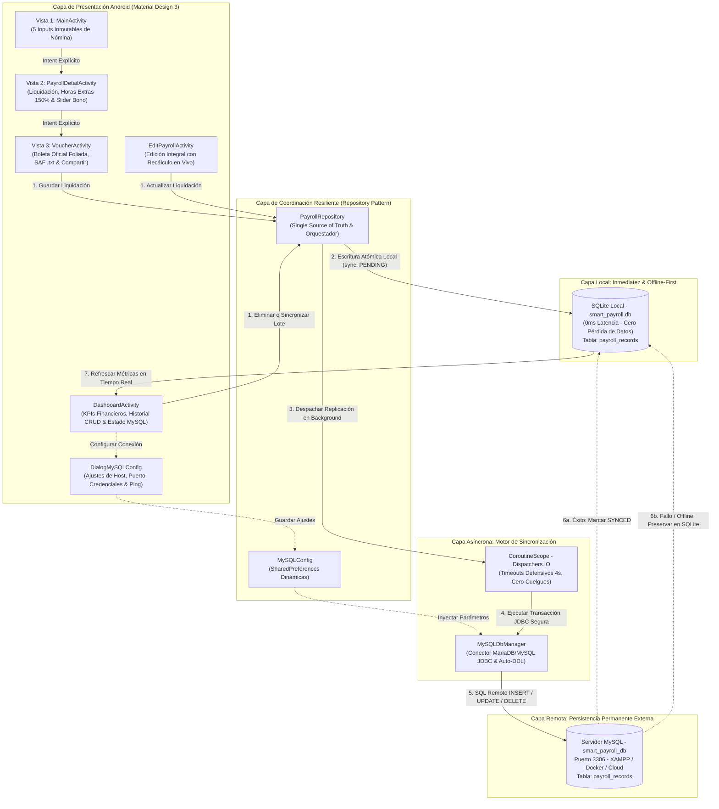
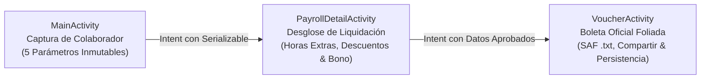
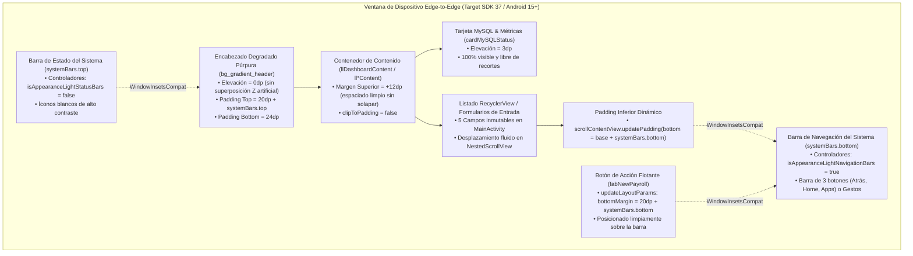

# SmartPayroll Pro — Sistema Móvil de Liquidación de Nómina con MySQL Resiliente

[](https://kotlinlang.org/)
[](https://developer.android.com/)
[](https://www.mysql.com/)
[](https://www.sqlite.org/)
[](https://m3.material.io/)
[](https://gradle.org/)

Aplicación móvil nativa en **Android (Kotlin)** desarrollada para la **Actividad 1 (Semana 3)** del curso **Desarrollo de Aplicaciones Móviles** en la **Universidad Privada del Norte (UPN)**.

---

## 🏛️ Ficha Académica e Institucional

- **Institución:** Universidad Privada del Norte (UPN)
- **Facultad:** Ingeniería
- **Carrera:** Ingeniería de Sistemas Computacionales
- **Curso:** Desarrollo de Aplicaciones Móviles (2026-II)
- **Estudiante:** Orlando Dorival
- **Tema:** Persistencia permanente en **Base de Datos MySQL**, arquitectura híbrida **Offline-First**, navegación multi-actividad con `Serializable` y diseño Material 3.

---

## 🌐 Arquitectura Resiliente a Fallos (Offline-First + MySQL)

Para responder a la solicitud docente de persistencia permanente en **MySQL**, se diseñó una **Arquitectura Híbrida Tolerante a Fallos**:

En entornos móviles, los dispositivos enfrentan cortes de red, cambios de IP o servidores locales apagados (XAMPP / Docker / Workbench). Una aplicación que dependa únicamente de llamadas síncronas remotas sufriría cuelgues (ANR), bloqueos de hilo principal o pérdida irreparable de liquidaciones.



> **Diagrama Vectorial Escalable:** Puedes visualizar el diagrama vectorial SVG compilado en [`mermaid diagramas/arquitectura_resiliente_mysql.svg`](mermaid%20diagramas/arquitectura_resiliente_mysql.svg).

### Pilares de la Resiliencia:
1. **Single Source of Truth (SSOT) Local en SQLite:** Todo cálculo o modificación se guarda inmediatamente en la base de datos local `smart_payroll.db` (latencia 0 ms). Nunca se pierden datos si no hay conectividad.
2. **Replicación Asíncrona con Timeouts Defensivos:** Un hilo dedicado en segundo plano (`Dispatchers.IO`) gestiona la conexión JDBC MariaDB/MySQL con un timeout estricto de 4 segundos, previniendo congelamientos de interfaz.
3. **Auditoría de Estados de Sincronización:** Cada registro rastrea si está `SYNC_STATUS_SYNCED` (1, Nube verde), `SYNC_STATUS_PENDING` (0, Nube amarilla) o `SYNC_STATUS_ERROR` (2, Modo local/offline).
4. **Sincronización en Lote (Batch Sync):** Un botón interactivo en el Dashboard permite reintentar y subir masivamente todos los comprobantes pendientes una vez restablecida la conexión con MySQL.
5. **Configuración Dinámica de Servidor:** Diálogo integrado para modificar IP/Host, puerto, base de datos y credenciales en caliente sin necesidad de recompilar la aplicación.

---

## 🗄️ Configuración de la Base de Datos MySQL

### Opción A: Importación con Script SQL (`smart_payroll.sql`)
1. Inicia tu servidor MySQL (vía **XAMPP**, **WampServer**, **MySQL Workbench** o **Docker**).
2. Abre tu gestor de base de datos preferido (ej. phpMyAdmin en `http://localhost/phpmyadmin`).
3. Importa el archivo maestro incluido en el proyecto: [`smart_payroll.sql`](smart_payroll.sql).
4. El script creará la base de datos `smart_payroll_db`, la tabla `payroll_records` con índices optimizados y cargará 3 registros de prueba.

### Opción B: Auto-creación DDL Automática desde la App
Si el servidor MySQL está activo pero la base de datos o la tabla no existen, la aplicación Android detectará la ausencia y ejecutará automáticamente la sentencia `CREATE DATABASE IF NOT EXISTS` y `CREATE TABLE IF NOT EXISTS` en su primer contacto.

### 🔌 Parámetros de Red y Conexión en Android:
- **En Emulador de Android Studio:** Usa el host `10.0.2.2` (alias que Android asigna a la máquina anfitriona donde corre MySQL).
- **En Dispositivo Físico:** Conecta tu celular a la misma red Wi-Fi que tu PC y coloca la IP local de tu computadora (ej. `192.168.1.50`).
- **Puerto:** `3306` (puerto estándar MySQL).
- **Usuario / Clave:** `root` / `""` (valores por defecto de XAMPP, editables desde la app).

---

## 📱 Flujo de las 3 Vistas Oficiales (Inmutables)



1. **Vista 1 (`MainActivity`):** Captura estricta de los 5 parámetros exigidos por la cátedra docente:
   - `Nombres` (`etFirstName`)
   - `Apellidos` (`etLastName`)
   - `Código de Colaborador` (`etEmployeeCode`)
   - `Tarifa por Hora` (`etHourlyRate`)
   - `Horas Trabajadas` (`etHoursWorked`)
2. **Vista 2 (`PayrollDetailActivity`):** Liquidación con slider interactivo de bono (0% a 30%), desglose de jornada legal (40 hrs), recargo del 150% en horas extraordinarias y retenciones de ley (Salud 4%, Pensión 4%).
3. **Vista 3 (`VoucherActivity`):** Boleta foliada con sello de auditoría, descarga de archivo `.txt` mediante Storage Access Framework (SAF), despacho por Intent implícito (`ACTION_SEND`) y almacenamiento automático en SQLite y MySQL.

---

## 📐 Reglas de Negocio Implementadas

$$\text{Horas Regulares} = \min(\text{Horas Trabajadas}, 40.0)$$

$$\text{Horas Extras} = \max(0.0, \text{Horas Trabajadas} - 40.0)$$

$$\text{Pago Horas Extras} = \text{Horas Extras} \times (\text{Tarifa Hora} \times 1.5)$$

$$\text{Total Bruto} = \text{Subtotal} + (\text{Subtotal} \times \text{Bono}\%)$$

$$\text{Deducciones} = \text{Salud (4\%)} + \text{Pensión (4\%)} = \text{Total Bruto} \times 0.08$$

$$\text{Total Neto} = \text{Total Bruto} - \text{Deducciones}$$

---

## 🎨 Diseño Visual Responsivo y Arquitectura Edge-to-Edge (Android 15+ / Target SDK 37)

Para garantizar una experiencia visual pulcra y sin recortes en pantallas con recortes de cámara (punch hole/notch) y con la barra de navegación del sistema (3 botones clásicos o barra de gestos), se implementó el módulo centralizado [`EdgeToEdgeHelper.kt`](app/src/main/java/com/example/act1sem3appsmov/EdgeToEdgeHelper.kt):



> **Diagrama Vectorial Escalable:** Puedes visualizar el diagrama vectorial SVG compilado en [`mermaid diagramas/arquitectura_ui_edgetoedge.svg`](mermaid%20diagramas/arquitectura_ui_edgetoedge.svg).

### Mejoras Clave de Interfaz:
1. **Tope Superior (Header vs. Tarjetas):** Se reemplazaron márgenes negativos que provocaban que las tarjetas quedaran ocultas bajo el borde curvo del encabezado degradado por espaciados limpios de `12dp` con elevaciones controladas (`0dp` en el contenedor y `3dp` en la tarjeta).
2. **Tope Inferior (Barra de Navegación vs. Botones y FAB):** Se enlazó `ViewCompat.setOnApplyWindowInsetsListener` para calcular dinámicamente la altura de `systemBars.bottom`, elevando el botón flotante `fabNewPayroll` y extendiendo el `paddingBottom` de las vistas de desplazamiento (`NestedScrollView`).
3. **Contraste de Iconografía del Sistema:** `isAppearanceLightStatusBars = false` mantiene íconos blancos legibles sobre el encabezado púrpura, mientras `isAppearanceLightNavigationBars = true` asegura íconos oscuros sobre el fondo claro de la barra de navegación.
4. **Protección Horizontal y Plegables:** Se inyectan los insets laterales (`systemBars.left`, `systemBars.right`) previniendo que los bordes de la pantalla recorten los campos en orientación horizontal o en pantallas plegables.

---

## 🧪 Pruebas Unitarias y Automatización

Para validar la solidez de las fórmulas matemáticas, transiciones de estado de sincronización y ciclo de vida CRUD, se ejecutan las pruebas unitarias:

```powershell
./gradlew testDebugUnitTest --no-daemon
```

*Resultado de verificación local:* **100% de pruebas superadas (28 tareas ejecutadas con éxito)**.
*Integración continua:* Validado automáticamente en GitHub Actions mediante el workflow `.github/workflows/jules-ci.yml`.

---

## 🚀 Compilación y Ejecución

### Desde Android Studio
1. Clonar el repositorio:
   ```bash
   git clone https://github.com/Orlandho/Act1Sem3AppsMov.git
   ```
2. Abrir en **Android Studio**.
3. Sincronizar Gradle y ejecutar en el emulador (recuerda que el host por defecto `10.0.2.2` se conecta automáticamente a tu MySQL en `localhost:3306`).

### Desde Consola
```powershell
./gradlew.bat assembleDebug
```
El APK resultante se generará en:
`app/build/outputs/apk/debug/app-debug.apk`
